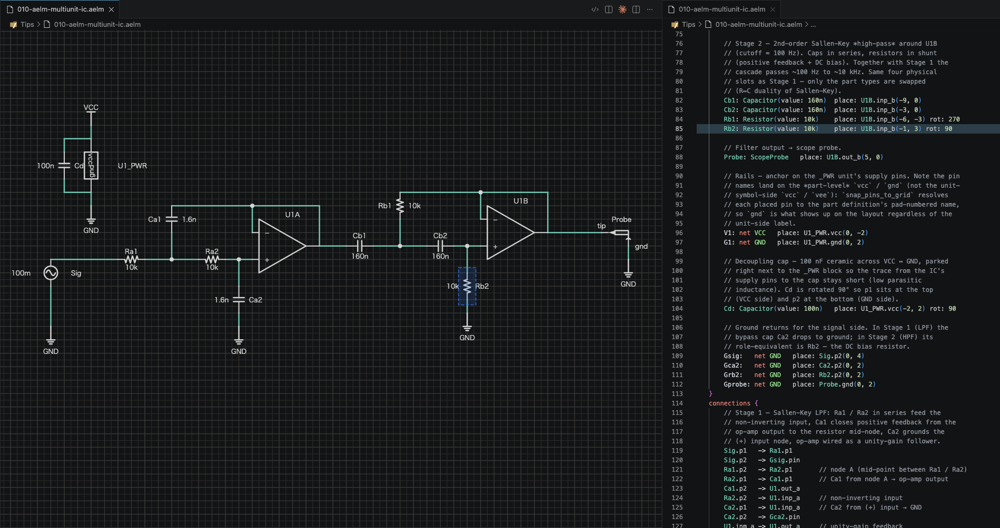

  

  
  

# AELM — Agent-native Electronic Layout Markup

AELM is a text-based electronic circuit CAD tool that runs as a VSCode extension powered by Rust and WebAssembly. Define circuits using a dedicated DSL, render schematics automatically, and manage your designs with version control.

## Quick Start

1. Install the [AELM extension](https://marketplace.visualstudio.com/items?itemName=alphaelements.aelm) from the VSCode Marketplace
2. Create a file with the `.aelm` extension
3. The schematic renders live as you type

## Examples

The [`examples/`](examples/) directory contains ready-to-open circuit files:

| File | Description |
|---|---|
| `transistor_circuit.aelm` | Constant-current source (NPN current mirror) |
| `all_symbols.aelm` | Gallery of all built-in symbols |
| `flow-chart-power-on.aelm` | Power-on sequence flow chart |
| `multi_unit_lm358.aelm` | Multi-unit IC (op-amp) with shared supply |
| `block_symbol_gallery.aelm` | Block diagram symbols overview |

## Tips

The [`tips/`](tips/) directory is a self-contained `.aproj` workspace with annotated `.aelm` files covering DSL fundamentals:

| File | Topic |
|---|---|
| `001-opamp-noninverting-amp.aelm` | Op-amp non-inverting amplifier |
| `002-rc-lowpass-filter.aelm` | RC low-pass filter |
| `003-voltage-divider.aelm` | Resistor voltage divider |
| `004-led-current-limiter.aelm` | LED current limiting |
| `005-npn-transistor-switch.aelm` | NPN transistor switch |
| `006-aelm-hello-world.aelm` | Minimal DSL hello world |
| `007-aelm-relative-placement.aelm` | Pin-relative placement |
| `008-aelm-rotation.aelm` | Instance rotation |
| `009-aelm-power-symbols.aelm` | Power and ground symbols |
| `010-aelm-multiunit-ic.aelm` | Multi-unit IC parts |

## License

**The AELM software** (VSCode extension, Rust/WASM core, language server) is proprietary software © 2026 Alpha Elements. All rights reserved.

**This repository** (DSL examples, standard library files, tips, logo, and documentation) is released under the [MIT License](LICENSE). You are free to use, copy, and modify these files without restriction.

**Your work is yours.** Files you create using the Aelm DSL (`.aelm`, `.alib`) and any outputs generated from them (SVG diagrams, netlists, etc.) are owned by their respective authors. Alpha Elements makes no copyright claim over user-authored content.
